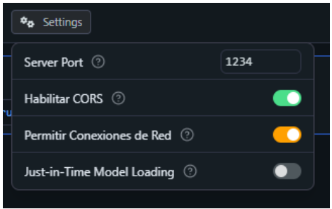
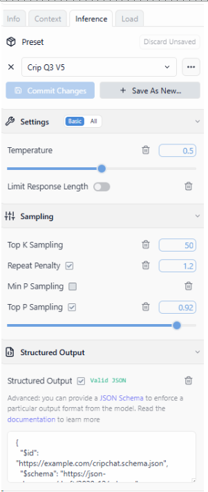

# Cripping-LLM
documentation of the chatbot development
# LM Studio + Qwen3 4B Instruct (2507) — Quick Start

Follow these steps to install **LM Studio**, download the **Qwen3 4B Instruct (2507)** model, and enable **Developer Mode**.

---

## Prerequisites
- A computer running **Windows/macOS/Linux** with an internet connection
- ~6–8 GB free disk space (installer + model)

---

## 1) Download and Install LM Studio
1. Go to **[lmstudio.ai](http://lmstudio.ai)**.
2. Download the **LM Studio Installer** for your operating system.
3. Run the installer and follow on-screen prompts to complete installation.

> Tip: After installation, launch **LM Studio** from your Applications/Programs menu.

---

## 2) Download the Qwen3 4B Instruct (2507) Model
1. Open this model page in your browser:  
   **<https://lmstudio.ai/models/qwen/qwen3-4b-2507>**
2. In **LM Studio**, use the **Models** or **Explore** tab and search for:  
   `Qwen3 4B Instruct 2507`
3. Click **Download** (or **Add** → **Download**) and wait for the model to finish downloading.

> Note: Model names are case-sensitive; confirm the exact variant **“Qwen3 4B Instruct (2507)”**.

---

## 3) Enable Developer Mode
1. Open **LM Studio**.
2. Go to **Settings** (gear icon ⚙️ in the sidebar or top-right menu).
3. Find **Developer Mode** and toggle it **On**.

> Why enable Developer Mode? It exposes advanced options useful for local API usage, debugging, and fine-grained configuration.
>

4. Check the server settings with your ip number

---

## 4) Model settings and template prompt

On the right side of LM Studio, open the **panel with tabs** and set the values to match these screenshots.

### A) Load tab (memory & performance)
Match these values:
- **Context Length:** `9096`  
- **GPU Offload:** `36/36` (max for your GPU)  
- **CPU Thread Pool Size:** `12`  
- **Evaluation Batch Size:** `512`  
- **Offload KV Cache to GPU Memory:** **On**  
- Leave **RoPE Frequency Base/Scale** unchecked (Auto)  
- Keep others at defaults unless you know you need them.

### B) Inference tab (sampling & limits)
Match these values:
- **Temperature:** `0.4`  
- **Limit Response Length:** **On**, **Max tokens:** `512`  
- **Top K Sampling:** `70`  
- **Repeat Penalty:** `1.07`  
- **Min P Sampling:** `0.03`  
- **Top P Sampling:** `0.94`  
- Leave **Structured Output** as shown (only enable when you need JSON).

---

### C) Where to put the template prompt (System Prompt)

1. Go to the **Chat** view for your model.
2. At the top of the chat panel, find the **System Prompt** (sometimes labeled **Instructions** or **System**).  
   - It’s the text area **above** the message box, with placeholder text like *“Set behavior, style, or constraints…”*.
3. **Paste your template prompt** there.  
4. To keep both the **Inference** settings and your **System Prompt** together:
   - Open the **Inference** tab (right panel).
   - Click **Save As New…** next to **Preset** and give it a name (e.g., `Crip Q3 v4`).
   - Next time, select this preset to restore your settings and system prompt.

> If you don’t see a **System Prompt** box: click the small caret **˅** above the message input to expand it, or open **Chat Settings** (gear icon) and enable **Show System Prompt**.

---

### Troubleshooting images
If the images don’t render on GitHub:
- Make sure the files are in your repo at `assets/lmstudio-load.png` and `assets/lmstudio-inference.png`.
- Filenames and paths are **case-sensitive**.
- Use relative paths as shown above.

---

## Troubleshooting
- **Can’t find the model?** Double-check the exact name and version: *Qwen3 4B Instruct (2507)*.
- **Download stalls?** Pause/resume the download or restart LM Studio.
- **Low VRAM/Memory?** Try lowering context length or system settings in **Settings → Performance**.

---

## Attributions
- LM Studio: <http://lmstudio.ai>
- Qwen3 4B Instruct (2507) model page: <https://lmstudio.ai/models/qwen/qwen3-4b-2507>

---

*Keep this README in your repository root as `README.md` so teammates can follow the same setup.*
